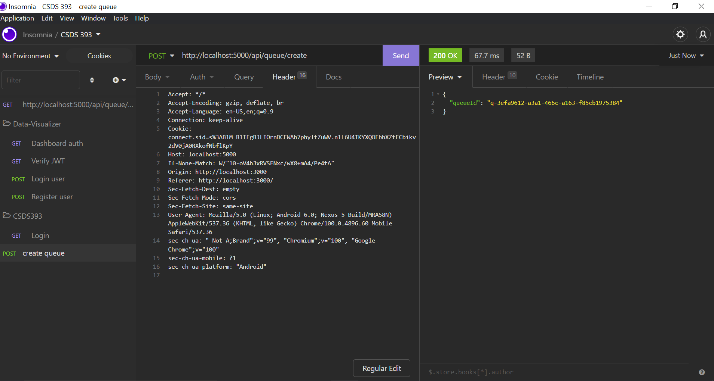

# Testing with Insomnia

The browser being used is <em>Google Chrome</em> so it might be different if you using a different browser, but generally the process should be the same.

1. At root directory run `yarn start`. If you get any module errors run `yarn install`.

2. After the server starts up, head to `http://localhost:3000/login ` 
on your browser.
3. This will bring you to our login page. Select <em>Sign in With Google</em> for now. We haven't tested Facebook yet.

4. Choose an account to login with or use our shared Gmail account. 

```
email: lyneapp776@gmail.com
password: lemonadeseller123
```

5.  After successfully logging in, the page should say <em>Dashboard</em>. Proceed to access the developer tools by right-clicking the page and clicking inspect element.

6. Now click on the <em>Network </em> tab and have <em>Fetch/XHR</em> selected. You should see the verify with status `200` request like below:


7. Right click on the request and click `Copy` -> `Copy request headers`.


8. Now open up `Insomnia` and go to a protected endpoint. For this guide, we will be using `http://localhost:5000/api/queue/create` . Before we do anything, make sure to delete all your cookies.


9. Now click on `Header` -> `Bulk Edit` -> copy paste the request headers we got earlier into the `Header`. Now make sure to delete the line that is similar to `GET /api/session/verify HTTP/1.1` or else it won't work. If you see something similar as the picture below, then you're all set!

