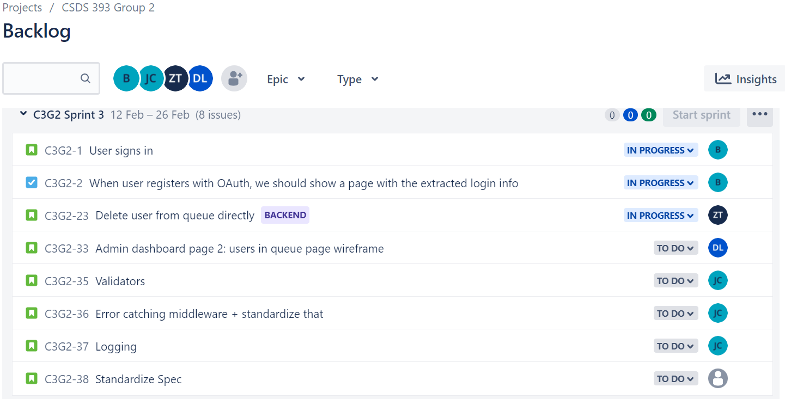
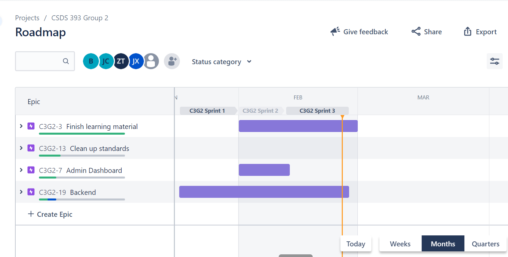

<<<<<<< HEAD

# Bi-Weekly Progress Report

=======

# CSDS 393: Bi-Weekly Progress Report 2

> > > > > > > origin/main

**Current Scrum Master:** Benson Jin (bxj155@case.edu)

**Other group members:**

- Joseph Chen (jxc1598@case.edu)
- Daniel Lee (dkl40@case.edu)
- Di Zhou (dxz266@case.edu)
- Zhongyuan Tang (zxt139@case.edu)
- Jalen Xu (jalen.xu@case.edu)

## Project Board

We manage the user stories and individual tasks through Jira and the Jira backlog.

We also organize our stories and tasks in epics on the roadmap:

## Assigned Stories

**Status as of 2/25/22**

- **Jody:** Add user signup page to join queue
- **Status:** Finished user signup page as. of 2/15/22 Currently working on user waiting line page after a user has joined a queue. Need to wait for backend to finish up authentication.

- **Daniel:** Create a queue admin dashboard so admin can see list of users in queue.
  - **Status:** Still working on it.
- **Joseph:** Convert repository to TypeScript and use Lerna for better managment. Also help Benson with authentication setup using Passport.
  - **Status:** Finished Lerna Repo; Currently working on error middleware along with validators.
- **Benson:**
  With Joseph, setup OAuth 2.0 using passport for authentication.

  - **Status:** Working on adding user to database after authentication. Need to setup authentication with Facebook and Twitter as well.

- **Jalen:** An admin should be able to pop a user from a queue. (Backend only)
  - **Status:** Finished endpoint that allows admin to pop user from a queue. Currently working on creating interfaces for the queue file.
- **David:** An admin should be able to delete user from queue. (Backend only)
  - **Status:** Still testing and debugging the delete user from queue endpoint.

# Standup Meetings

## Feb 12th/19th Meeting Notes

| Student | What has been done                                                                                                     | What remains                                                        |
| ------- | ---------------------------------------------------------------------------------------------------------------------- | ------------------------------------------------------------------- |
| Joseph  | <ul><li>Set up OAuth 2.0 using passport for authentication.</li><li>Switched from DaisyUI to ChakraUI</li>             | <li> Convert repository to TypeScript and use Lerna </li>           |
| Benson  | <ul><li>Set up OAuth 2.0 for authentication using Passport</li><li>Endpoints for Google OAuth 2.0 work </li></ul>      | <ul><li>Need to connect authentication to database</li></ul>        |
| Jody    | <ul><li>Learned how to create a simple create queue button</li></ul>                                                   | <ul><li>Create a simple user signup page to join a queue</li></ul>  |
| Daniel  | <ul><li>Learned how to create a simple create queue button</li></ul>                                                   | <ul><li>Create an admin dashboard </li><ul>                         |
| David   | <ul><li>Learning Javascript and Express</li></li></ul>                                                                 | <ul><li>Create an endpoint to delete a user from a queue</li> </ul> |
| Jalen   | <ul><li>Learning Javascript</li><li>Getting more comfortable with async/await and creating express endpoints</li></ul> | <ul><li>Create an endpoint to pop a user from a queue.</li></ul>    |

**Problems Faced:**

- Lots of material must be learned outside of class (i.e. Javascript + Express + REST for backend and HTML/CSS/JS/React for frontend).

- Currently, it is hard to debug code because JavaScript is not typed, so we are switching to TypeScript and using Lerna for managment.

**Risks:**

- Currently, the risk is that students don't learn quick enough to adequately complete the user stories in time. To mitigate the risk, Joseph pair programs with both the frontend and backend developers to get them up-to-speed.

## February 19th Meeting

(With both backend + frontend developers)

**TLDR; Similar to last time**

| Student | What has been done                                                                                                                                                                                                                     | What remains                                                                                                                                                |
| ------- | -------------------------------------------------------------------------------------------------------------------------------------------------------------------------------------------------------------------------------------- | ----------------------------------------------------------------------------------------------------------------------------------------------------------- |
| Joseph  | <ul><li>Did pair programming session with both frontend + backend</li><li>Helped Benson with setting up authentication</li><li>Switched to ChakraUI for frontend</li><li>Converted repository to TypeScript and to use Lerna</li></ul> | <ul><li>Setting up error middleware and validators</li></ul>                                                                                                |
| Benson  | <ul><li>Setup OAuth 2.0 using passport</li><li>Pair programmed with David to debug endpoint issues</li></ul>                                                                                                                           | <ul><li>Connect database to authentication</li><li>Finish setting up passport with Twitter and Facebook </li></ul>                                          |
| Jody    | <ul><li>Created a user signup page for joining a queue</li></ul>                                                                                                                                                                       | <ul><li>Working on a user waiting line page</li></ul>                                                                                                       |
| Daniel  | <ul><li>Working on queue admin dashboard</li></ul>                                                                                                                                                                                     | <ul><li>Continue working on queue admin dashboard </li> </ul>                                                                                               |
| David   | <ul><li>Worked on delete user from queue endpoint</li></ul>                                                                                                                                                                            | <ul><li>Still need to get comfortable with promises, async/await, and Express</li><li>Test and debug the endpoint to make sure it works properly.</li></ul> |
| Jalen   | <ul><li>Finished the pop user from queue endpoint</li></ul>                                                                                                                                                                            | <ul><li>Add interfaces to queue for readability </li></ul>                                                                                                  |

**Problems Faced:**

- Lots of material must be learned outside of class (i.e. Javascript + Express + REST for backend and HTML/CSS/JS/React for frontend).
- We needed share types hence why we made a mono repo using Lerna as well making sure request and responses are consistent.
- We wanted a consistent way to log operational errors through an error middleware.
- Get used to TypeScript

**Risks:**

- Currently, the risk is that students don't learn quick enough to adequately complete the user stories in time. To mitigate the risk, Joseph pair programs with both the frontend and backend developers to get them up-to-speed. Currently, the frontend developers are making significant progress and should be ready to properly tackle their assigned user stories. The backend developers need more mentoring and practice.
- Converting JavaScript to TypeScript might be difficult for those who aren't familiar.
