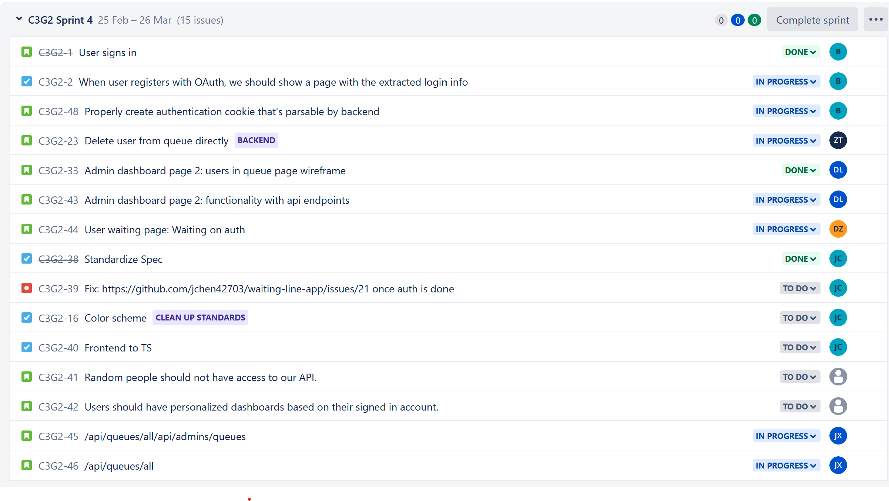
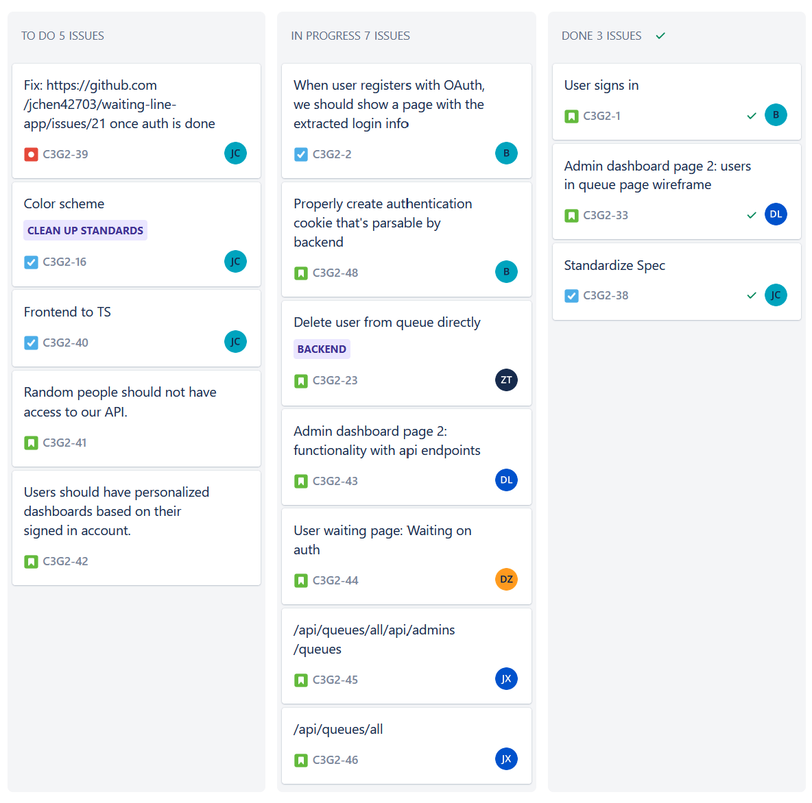

# CSDS 393: Bi-Weekly Progress Report 3

**Current Scrum Master:** Daniel Lee (dkl40@case.edu)

**Other group members:**

- Joseph Chen (jxc1598@case.edu)
- Benson Jin (bxj155@case.edu)
- Di Zhou (dxz266@case.edu)
- Zhongyuan Tang (zxt139@case.edu)
- Jalen Xu (jalen.xu@case.edu)

## Project Board

We manage the user stories and individual tasks through Jira and the Jira backlog.

We also organize our stories and tasks on the board:

## Assigned Stories

**Status as of 3/18/22**

- ~~**Jody:** Add user signup page to join queue~~
  Finished as of 3-18-22
- **Jody:** Add user waiting page.
- **Status:** Finished user signup page as of 3/18/22. Currently working on user waiting line page after a user has joined a queue. Need to wait for backend to finish up authentication.

- ~~**Daniel:** Create a queue admin dashboard so admin can see list of users in queue.~~
  Finished as of 3-18-22
- **Daniel:** Add functionality to buttons in admin dashboard 2 (Back button, delete button, next user button).
  - **Status:** Wireframe for admin dashboard 2 complete, adding functionality.
- **Joseph:** Check valid ID before creating queue https://github.com/jchen42703/waiting-line-app/issues/21; standardize app color scheme; convert frontend to typescript.
  - **Status:** Currently working on checking valid ID, standardizing color scheme.
- **Benson:** Create authentication cookie that's parsable by the backend.

  - **Status:** User authentication is complete, need to finish authentication cookie functionality.

- **Jalen:** An admin should be able to pop a user from a queue. (Backend only)
  - **Status:** Finished endpoint that allows admin to pop user from a queue. Currently working on creating interfaces for the queue file.
- **David:** An admin should be able to delete user from queue. (Backend only)
  - **Status:** Still testing and debugging the delete user from queue endpoint.

# Standup Meetings (3/5, 3/12)

**TLDR; Similar to last time**

| Student | What has been done                                               | What remains                                                                                               |
| ------- | ---------------------------------------------------------------- | ---------------------------------------------------------------------------------------------------------- |
| Joseph  | <ul><li>Converted backend to TypeScript</li></ul>                | <ul><li>Setting up a valid ID check before creating queue</li><li>Standardizing the color scheme</li></ul> |
| Benson  | <ul><li>Setup OAuth 2.0 using passport</li></ul>                 | <ul><li>Creatimng authentication cookie that's parsable by the backend</li></ul>                           |
| Jody    | <ul><li>Created a user signup page for joining a queue</li></ul> | <ul><li>Working on a user waiting line page</li><li>Learn TypeScript</li></ul>                             |
| Daniel  | <ul><li>Finished queue admin dashboard wireframe</li></ul>       | <ul><li>Add functionality to queue admin dashboard components </li><li>Learn TypeScript</li> </ul>         |
| David   | <ul><li>Worked on delete user from queue endpoint</li></ul>      | <ul><li>Continue working on delete user from queue endpoint</li></ul>                                      |
| Jalen   | <ul><li>Finished the pop user from queue endpoint</li></ul>      | <ul><li>Add interfaces to queue for readability </li></ul>                                                 |

**Problems Faced:**

- Lots of material must be learned outside of class (i.e. Javascript + Express + REST for backend and HTML/CSS/JS/React for frontend).
- Get used to TypeScript
- Color scheme is not standardized
- Backend is not easily testable
- Authentication is not complete, this causes a block for other developers

**Risks:**

- Converting JavaScript to TypeScript might be difficult for those who aren't familiar.
- No dedicated quality assurance team to integration test, which may introduce bugs to production.
- No CI/CD, which may also introduce bugs to production.
