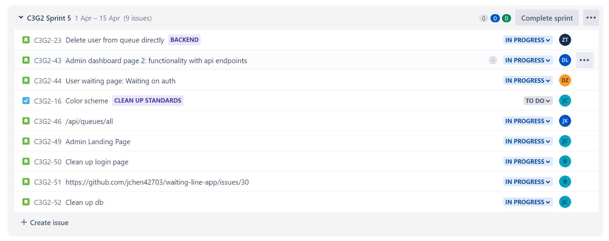

# CSDS 393: Bi-Weekly Progress Report 4

**Current Scrum Master:** Di Zhou (dxz266@case.edu)

**Other group members:**

- Joseph Chen (jxc1598@case.edu)
- Benson Jin (bxj155@case.edu)
- Daniel Lee (dkl40@case.edu)
- Zhongyuan Tang (zxt139@case.edu)
- Jalen Xu (jalen.xu@case.edu)

## Project Board

We manage the user stories and individual tasks through Jira and the Jira backlog.

## Assigned Stories

**Status as of 4/1/22**

- **Jody:** Add functionality to buttons in user waiting page.
  - **Status:** Currently working on getting the user's progress in the queue.
- **Daniel:** Connect the queue dashboard to the backend.
  - **Status:** Worked on deleting user and getting the next user in queue dashboard. Need to test the functionality.
- ~~**Joseph:** Convert frontend to typescript.~~
  Finished as of 4-1-22
- **Joseph:** Add admin landing page
  - **Status:** Converted frontend to typescript. Currently working on admin landing page.
- **Benson:** Add authentication cookie functionality
  - **Status:** Finished up adding a cookie validator middleware (checks that an admin has signed cookies) for endpoints that need to be protected. Need to test some edge cases as well as fix Daniel's issue with improper redirecting when logged in.
- **Jalen:** Create an endpoint that gets a list of all users in a queue and an endpoint that gets a list of all queueId's managed by an admin.
  - **Status:** Finished endpoint that get a list of all users in a queue. Still working on the endpoint that allows admin to get all queueId's they manages.
- **David:** An admin should be able to delete user from queue. (Backend only)
  - **Status:** Implemented deleteUser endpoint. Still testing and debugging it.

# Standup Meetings (3/19, 3/26)

**TLDR; Similar to last time**

| Student | What has been done                                                                                                                                                | What remains                                                                                                                               |
| ------- | ----------------------------------------------------------------------------------------------------------------------------------------------------------------- | ------------------------------------------------------------------------------------------------------------------------------------------ |
| Joseph  | <ul><li>Converted frontend to TypeScript</li></ul>                                                                                                                | <ul><li>Continue working on admin landing page</li></ul>                                                                                   |
| Benson  | <ul><li>Added a cookie validator middleware</li></ul>                                                                                                             | <ul><li>Test edge cases for the cookie validator middleware</li><li>Fix Daniel's issue with improper redirecting when logged in.</li></ul> |
| Jody    | <ul><li>Created a user waiting page for getting the waiting status</li><li>Learned TypeScript</li></ul>                                                           | <ul><li>Continue working on waiting status update</li><li>Allow users to exit the queue</li></ul>                                          |
| Daniel  | <ul><li>Added functionality to queue admin dashboard components</li><li>Learned TypeScript</li></ul>                                                              | <ul><li>Connect queue dashboard to backend (delete user, get next user)</li> </ul>                                                         |
| David   | <ul><li>Worked on testing and debugging</li></ul>                                                                                                                 | <ul><li>Test and debug the deleteUser endpoint</li></ul>                                                                                   |
| Jalen   | <ul><li>Worked on the endpoint that retrieves a list of users in a queue</li><li>Worked on the endpoint that retrieves a list of queueId's for an admin</li></ul> | <ul><li>Continue working on the endpoints (/api/admins/queues, /api/queues/all) </li></ul>                                                 |

**Problems Faced:**

- Lots of material must be learned outside of class (i.e. Javascript + Express + REST for backend and HTML/CSS/JS/React for frontend).
- Color scheme is not standardized
- Backend is not easily testable
- Authentication is not complete, this causes a block for other developers
- Some endpoints are not finished so some people are blocked

**Risks:**

- Converting JavaScript to TypeScript might introduce some bugs for those who aren't familiar with it.
- No dedicated quality assurance team to integration test, which may introduce bugs to production.
- No CI/CD, which may also introduce bugs to production.
