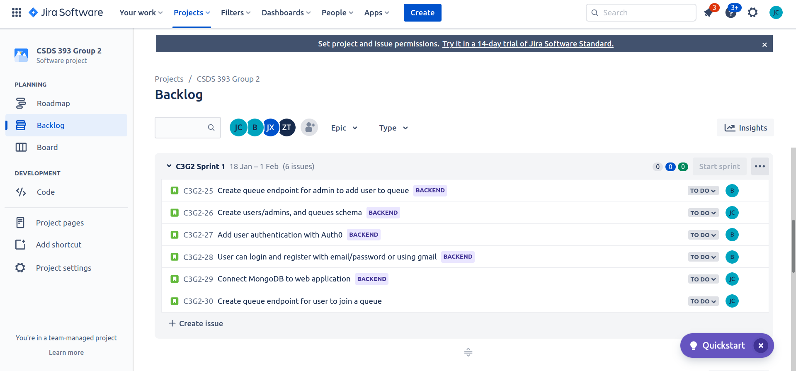
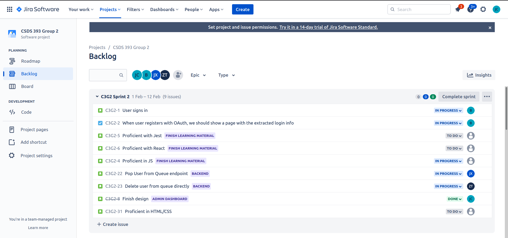
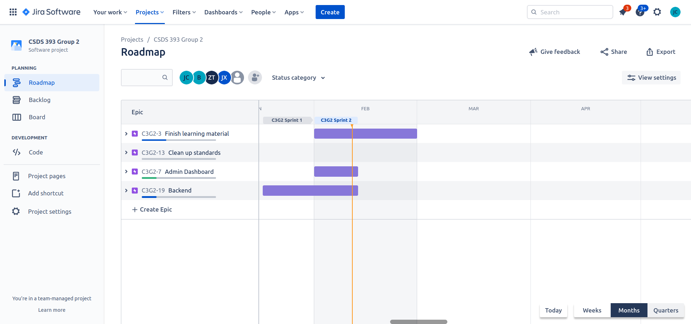

# Bi-Weekly Progress Report

**Current Scrum Master:** Joseph Chen (jxc1598@case.edu)

**Other group members:**

- Benson Jin (bxj155@case.edu)
- Daniel Lee (dkl40@case.edu)
- Di Zhou (dxz266@case.edu)
- Zhongyuan Tang (zxt139@case.edu)
- Jalen Xu (jalen.xu@case.edu)

## Project Board

We manage the user stories and individual tasks through Jira and the Jira backlog. Right now, many of the students in the group are still learning how to do web development and we did not convert our early tasks to user stories, so most tasks aren't necessarily "user stories."

We also organize our stories and tasks in epics on the roadmap:

## Assigned Stories

**Status as of 2/11/22**

- ~~**Jody & Daniel & Joseph:** finish page designs for the admin and user dashboards~~
  - Finished as of 2/11/22
- **Jody:** First user status page: user should see their queue status, eta, and registered information when they enter the queue.
  - **Status:** Getting started; Need to convene with Joseph for technical design
- **Daniel:** Admin Page 2: Admins should be able to see a list of users in their selected queue
  - **Status:** Getting started; Need to convene with Joseph for technical design
- **Joseph:** Users should be able to use the navigation bar to select a queue to display.
  - **Status:** Finished with DaisyUI, but unsatisfactory (buggy + doesn't integrate well with React). So, going to setup Ant Design + Less and convert build the navbar with those tools
- **Benson:**
  - Admins should be able to sign up to use our service.
  - Admins should be able to log out of their accounts.
  - Admins should be able to sign in to use our service.
  - Admins should see a customized dashboard.
  - Random people should not be able to access admin related resources.
  - **Status:** Investigating replacing the Auth0 workflow with a `passport` one
- **Jalen:** An admin should be able to pop a user from a queue. (Backend only)
  - **Status:** Getting started (still need to get comfortable with Javascript)
- **David:** An admin should be able to delete user from queue. (Backend only)
  - **Status:** Getting started (still need to get comfortable with Javascript)

# Standup Meetings

## January 22nd/29th Meeting Notes

| Student | What has been done                                                                                                                                                                                                                                                       | What remains                                                                                                                             |
| ------- | ------------------------------------------------------------------------------------------------------------------------------------------------------------------------------------------------------------------------------------------------------------------------ | ---------------------------------------------------------------------------------------------------------------------------------------- |
| Joseph  | <ul><li>Set up express for backend and React for frontend development</li><li>Set up MongoDB</li><li>Configured basic endpoints for creating and joining queues</li><li>Configured basic endpoints for popping user from queue and get a user's queue progress</li></ul> | <ul><li>App Design (Views + Components</li><li>Setting up Tailwind</li><li>Delegate specific user stories</li></ul>                      |
| Benson  | <ul><li>Set up Auth0 for authentication</li><li>/api/auth/login, /api/auth/register, and /api/auth/login endpoints work, but are not connected to the DB</li></ul>                                                                                                       | <ul><li>Need to configure Auth0 to work with our database</li><li>Configure the authentication middleware to protect endpoints</li></ul> |
| Jody    | <ul><li>Learned HTML and getting comfortable with CSS</li><li>Setup VSCode settings and extensions (Prettier, ESLint, BabelScript, Emmet, etc) to meet repository's standards</li></ul>                                                                                  | <ul><li>Need to get comfortable with CSS and Javascript</li><li>Need to learn React</li></ul>                                            |
| Daniel  | <ul><li>Learned HTML and getting comfortable with CSS</li><li>Also, went through the basic React tutorial</li><li>Setup VSCode settings and extensions (Prettier, ESLint, BabelScript, Emmet, etc) to meet repository's standards</li></ul>                              | <ul><li>Need to get comfortable with CSS and Javascript</li><li>Need to learn React</li></ul>                                            |
| David   | <ul><li>Learning Javascript</li><li>Setup VSCode settings and extensions (Prettier, ESLint, BabelScript, Emmet, etc) to meet repository's standards</li></ul>                                                                                                            | <ul><li>Still need to get comfortable with promises, async/await, and Express</li></ul>                                                  |
| Jalen   | <ul><li>Learning Javascript</li><li>Setup VSCode settings and extensions (Prettier, ESLint, BabelScript, Emmet, etc) to meet repository's standards</li></ul>                                                                                                            | <ul><li>Still need to get comfortable with promises, async/await, and Express</li></ul>                                                  |

**Problems Faced:**

- Lots of material must be learned outside of class (i.e. Javascript + Express + REST for backend and HTML/CSS/JS/React for frontend).

**Risks:**

- Currently, the risk is that students don't learn quick enough to adequately complete the user stories in time. To mitigate the risk, Joseph pair programs with both the frontend and backend developers to get them up-to-speed.
- User stories haven't been created and delegated yet, which may hinder developer motivation. However, this currently does not seem like an issue.

## February 5th Meeting

(With both backend + frontend developers)

**TLDR; Similar to last time**

| Student | What has been done                                                                                                                                                                                             | What remains                                                                                                               |
| ------- | -------------------------------------------------------------------------------------------------------------------------------------------------------------------------------------------------------------- | -------------------------------------------------------------------------------------------------------------------------- |
| Joseph  | <ul><li>Did pair programming session with both frontend + backend</li><li>Helped Benson with planning authentication</li><li>Set up Tailwind and DaisyUI for frontend</li><li>Delegated user stories</li></ul> | <ul><li>App Design (Views + Components)</li></ul>                                                                          |
| Benson  | <ul><li>Connected Auth0 endpoints to database</li><li>Configured the auth0 authentication middleware to protect endpoints</li></ul>                                                                            | <ul><li>Investigate alternatives to Auth0 (i.e. `passport`) for less vague + more secure authentication workflow</li></ul> |
| Jody    | <ul><li>Got more comfortable with HTML + CSS + SCSS</li></ul>                                                                                                                                                  | <ul><li>Need more practice with React + JS</li><li>App design</li></ul>                                                    |
| Daniel  | <ul><li>Practiced HTML/CSS</li></ul>                                                                                                                                                                           | <ul><li>Need more practice with React + JS</li><li>App design</li></ul>                                                    |
| David   | <ul><li>Learning Javascript</li></ul>                                                                                                                                                                          | <ul><li>Still need to get comfortable with promises, async/await, and Express</li></ul>                                    |
| Jalen   | <ul><li>Learning Javascript</li></ul>                                                                                                                                                                          | <ul><li>Still need to get comfortable with promises, async/await, and Express</li></ul>                                    |

**Problems Faced:**

- Lots of material must be learned outside of class (i.e. Javascript + Express + REST for backend and HTML/CSS/JS/React for frontend).
- Authentication with Auth0 seems to be harder than just doing authentication/authorization from scratch with `passport` due to the lack of good documentation of how worflows work under the hood (Benson + Joseph).
- Currently, tailwind seems like a good choice for increasing developer productivity. However, DaisyUI does not seem to integrate well with React, so Joseph should investigate alternatives

**Risks:**

- Currently, the risk is that students don't learn quick enough to adequately complete the user stories in time. To mitigate the risk, Joseph pair programs with both the frontend and backend developers to get them up-to-speed. Currently, the frontend developers are making significant progress and should be ready to properly tackle their assigned user stories. The backend developers need more mentoring and practice.
- Current framework isn't easily testable. The project leader, Joseph, should setup pair programming sessions for the developers to get comfortable with Jest/mocking/express testing.

## February 11th Meeting

(Frontend Only)

The purpose of this meeting was to flesh out the design.

| Student | What has been done                                                                                                                                                                            | What remains                                                                                                                                                                                                                             |
| ------- | --------------------------------------------------------------------------------------------------------------------------------------------------------------------------------------------- | ---------------------------------------------------------------------------------------------------------------------------------------------------------------------------------------------------------------------------------------- |
| Joseph  | <ul><li>Helped design page views for the admin dashboard + user queue status page</li><li>Set up React Router</li></ul>                                                                       | <ul><li>Finish navbar</li></ul>                                                                                                                                                                                                          |
| Jody    | <ul><li>Helped design page views for the admin dashboard + user queue status page</li><li>Set up VSCode to use tailwind (i.e. TailwindCSS extension + PostCSS settings + Stylelint)</li></ul> | <ul><li>First user status page: user should see their queue status, eta, and registered information when they enter the queue.</li><li>Should pair program with Joseph to flesh out the technical design (only UI is finished)</li></ul> |
| Daniel  | <ul><li>Helped design page views for the admin dashboard + user queue status page</li><li>Set up VSCode to use tailwind (i.e. TailwindCSS extension + PostCSS settings + Stylelint)</li></ul> | <ul><li>Admin Page 2: Admins should be able to see a list of users in their selected queue</li><li>Should pair program with Joseph to flesh out the technical design (only UI is finished)</li></ul>                                     |

**Problems Faced and Risks:**

- Same as last meeting. Still need to investigate alternatives to DaisyUI (i.e. Ant Design, Material UI, Bootstrap, Semantic UI, Chakra UI) because DaisyUI does not integrate into React well.
